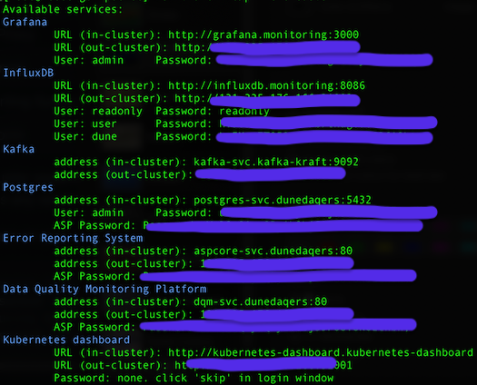
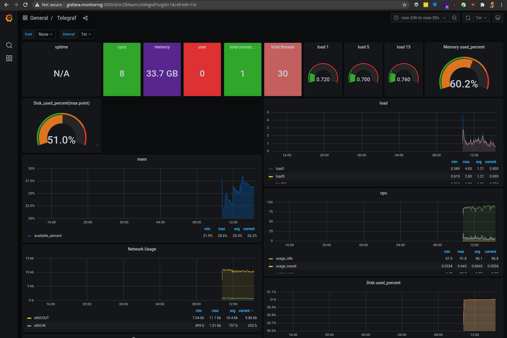

# PocketDUNE

Setup a demo installation of DUNE DAQ in a variety of setups.

## Quick-start

For a cluster with all built-in services enabled:
```bash
make setup.local
# equivalent to
# SERVICES=ECK,opmon,dashboard make setup.local
```

This will setup your local (one-node) cluster, and print out available default services and their access credentials.

To start a cluster without ElasticSearch
```bash
SERVICES=opmon,dashboard make setup.local
```



## Accessing services
For developer convenience, the cluster will have a http proxy running for you to access any services internal to the cluster.

This proxy runs on port `31000` and is usable using curl
```bash
$ # when using local deployment
$ curl --socks5 localhost:31000 --socks5-hostname localhost:31000 http://example-server
$ # when using OpenStack
$ curl --socks5 https://mycernusername-pocketdune.cern.ch:31000 --socks5-hostname https://mycernusername-pocketdune.cern.ch:31000 http://example-server
```

or a webbrowser using foxyproxy  




## supported setups

### locally on your own machine
This will create a single node cluster.  
The only requirement is a working installation of `docker`, other binaries required for setup are downloaded automatically and require no sudo privileges.
```bash
$ make setup.local
```

To destroy after you finished, run
```bash
$ make destroy.local
```

### CERN OpenStack
This will create a two-node cluster (by default). You will need Python3.8 or higher and ssh client on your local machine. Other binaries required for setup are downloaded automatically and require no sudo privileges.

You will need to authenticate with CERN OpenStack, the makefile will help you do that if you don't know how.
```bash
$ make setup.openstack
```

This will create a `terraform.tfstate` file in `./openstack/terraform`. Keep this file, and keep it secret, for as long as you wish to have your cluster.
It contains your SSH key, there is no other place where you can retrieve this.

If you are not on the CERN network, open a proxy using `ssh -D 12345 lxplus.cern.ch`.
You can then execute `HTTP_PROXY=https://localhost:12345 make setup.openstack`.

To destroy after you finished, run
```bash
$ make destroy.openstack
```

You can change the number and flavor of machines to use by editing [terraform/wanted.tf](terraform/wanted.tf)